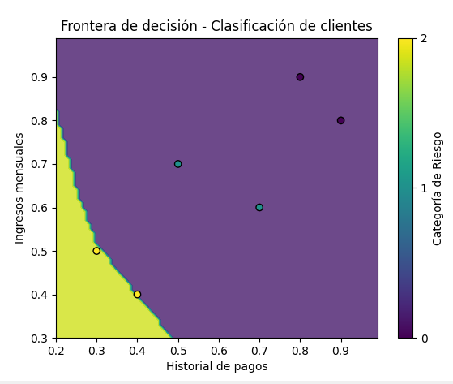

# ¿Son los datos linealmente separables?

viendo la grafica me parece muy complicado que sean linealmente separables gracias a que los datos no se relacionan tanto por lo cual no tienen un comportamiento lineal.

# ¿Qué ajustes podrían hacer al modelo para mejorar la predicción?

Podríamos hacer la red más grande o ajustar algunos parámetros para que funcione mejor.

# modelo

## Crear el modelo
model = Sequential([
    Dense(10, activation='relu', input_shape=(3,)),  # Capa oculta con 10 neuronas
    Dense(3, activation='softmax')                  # Capa de salida con 3 categorías
])

Hago una red neuronal con dos capas:
Una capa con 10 neuronas que activan con relu.
Otra capa con 3 neuronas, una para cada categoría, que usa softmax para clasificar.

## Entrenar el modelo

model.fit(X, y_encoded, epochs=500, verbose=0)

Entreno el modelo con los datos X y las etiquetas transformadas y_encoded durante 500 épocas. Esto permite que el modelo aprenda a clasificar correctamente.

# grafica
