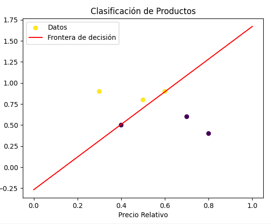

# ¿Son los datos linealmente separables?

Si serian linealmente separables por lo que se ve en la grafica que esta aqui

# ¿Qué ajustes podrían hacer al modelo para mejorar la predicción?

Si los datos no fueran separables podríamos usar más características o un modelo más avanzado como una red neuronal.

# modelo

w = np.random.rand(2)  # Pesos iniciales
b = np.random.rand()   # Sesgo inicial
learning_rate = 0.1    # Tasa de aprendizaje

Se asignan valores aleatorios a los pesos y al sesgo, que se ajustarán durante el entrenamiento. La tasa de aprendizaje define qué tan grandes serán esos cambios.

## funcion de activacion 
def step_function(z):
    return 1 if z >= 0 else 0

Uso esta función para decidir si un producto es aceptado 1 o rechazado 0. Si el resultado z es mayor o igual a 0, devuelve 1; si no, devuelve 0.

## entrenar modelo 
for epoch in range(100):  # 100 épocas de entrenamiento
    for i in range(len(X)):
        z = np.dot(w, X[i]) + b  # Predicción
        y_pred = step_function(z)
        error = y[i] - y_pred    # Error
        # Actualización de pesos y sesgo
        w += learning_rate * error * X[i]
        b += learning_rate * error

Entreno el modelo recorriendo los datos 100 veces. Para cada producto, hago una predicción, comparo si fue correcta y, si no, ajusto los pesos y el sesgo usando el error. Así, el modelo mejora poco a poco.

# grafica
